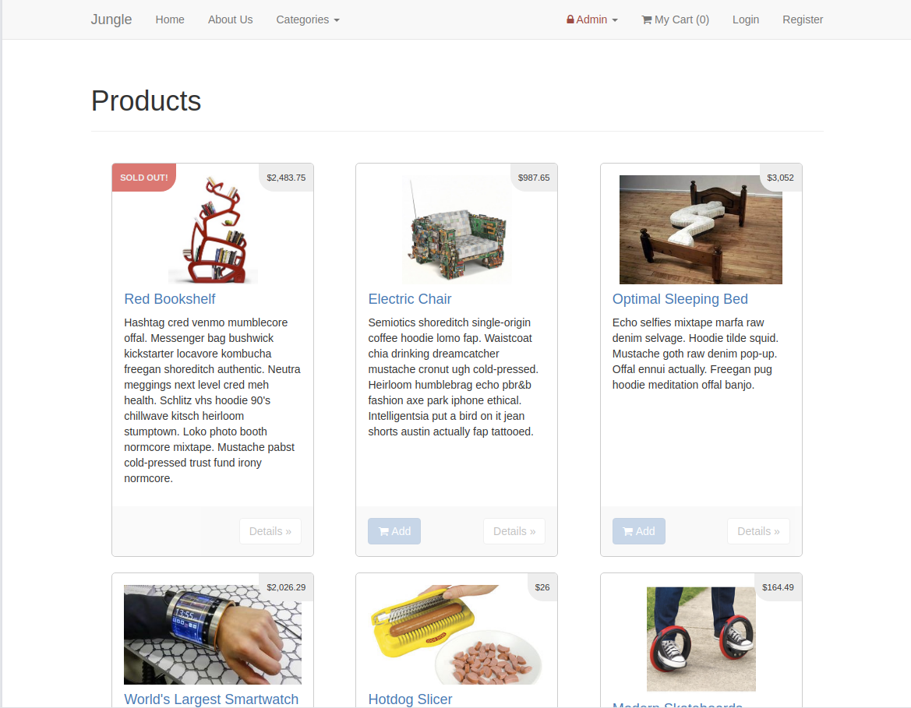
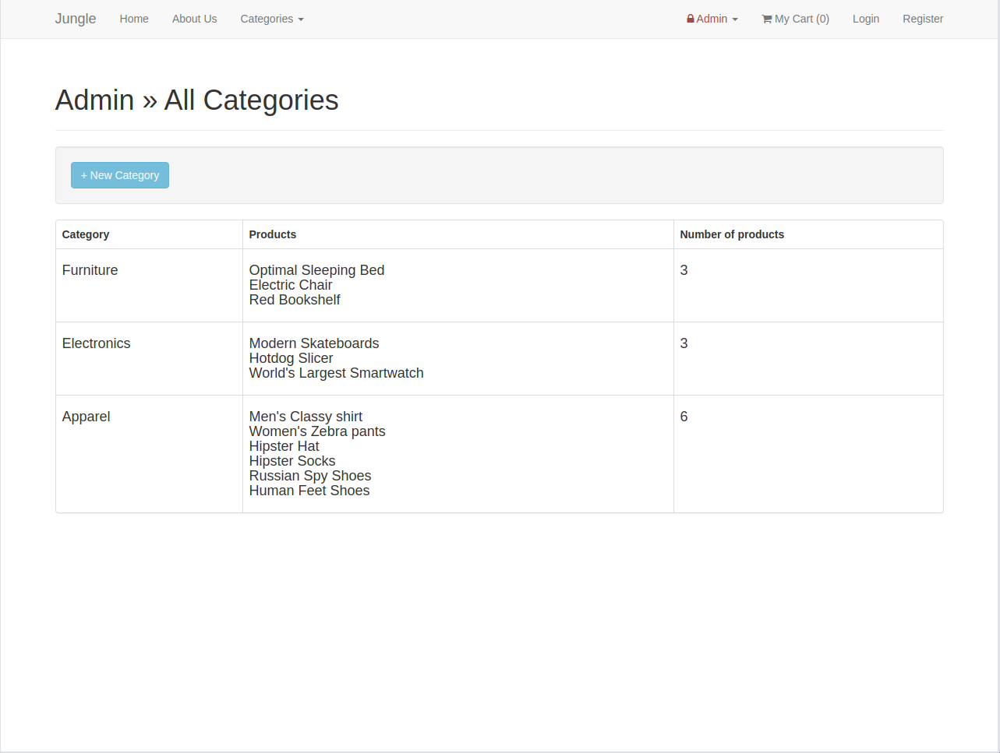
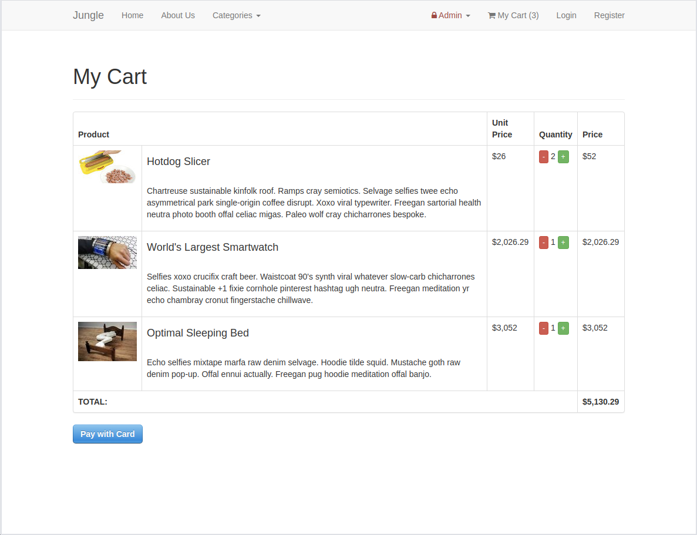
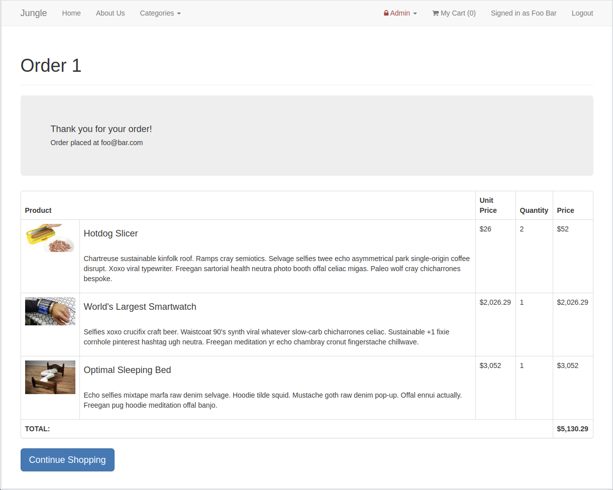

# Jungle

Jungle is a mini e-commerce application built with Ruby 2.3.5 & Rails 4.2.

Thanks to this project I learned more about Ruby on Rails, the Model-View-Controller paradigm, Embedded Ruby and testing (TDD & BDD).

## Notes:
- Known issue: a guest (non-authenticated) user can still place orders. Forbidding this option should be the next step.

### Home page

### Admin Categories page

### Cart page

### Cart page

## Setup

1. Run `bundle install` to install dependencies
2. Create `config/database.yml` by copying `config/database.example.yml`
3. Create `config/secrets.yml` by copying `config/secrets.example.yml`
4. Run `bin/rake db:reset` to create, load and seed db
5. Create .env file based on .env.example
6. Sign up for a Stripe account
7. Put Stripe (test) keys into appropriate .env vars
8. Run `bin/rails s -b 0.0.0.0` to start the server

## Stripe Testing

Use Credit Card # 4111 1111 1111 1111 for testing success scenarios.

More information in their docs: <https://stripe.com/docs/testing#cards>

## Dependencies

* Rails 4.2 [Rails Guide](http://guides.rubyonrails.org/v4.2/)
* PostgreSQL 9.x
* Stripe
* Jquery-rails
* Jbuilder 2.0
* Sdoc 0.4.0
* Bcrypt 3.1.7
* Sass-rails 5.0
* Bootstrap-sass 3.3.6
* Uglifier 1.3.0
* Turbolinks
* Puma
* Font-awesome-rails
* Money-rails
* Carrierwave
* Rmagick
* Faker